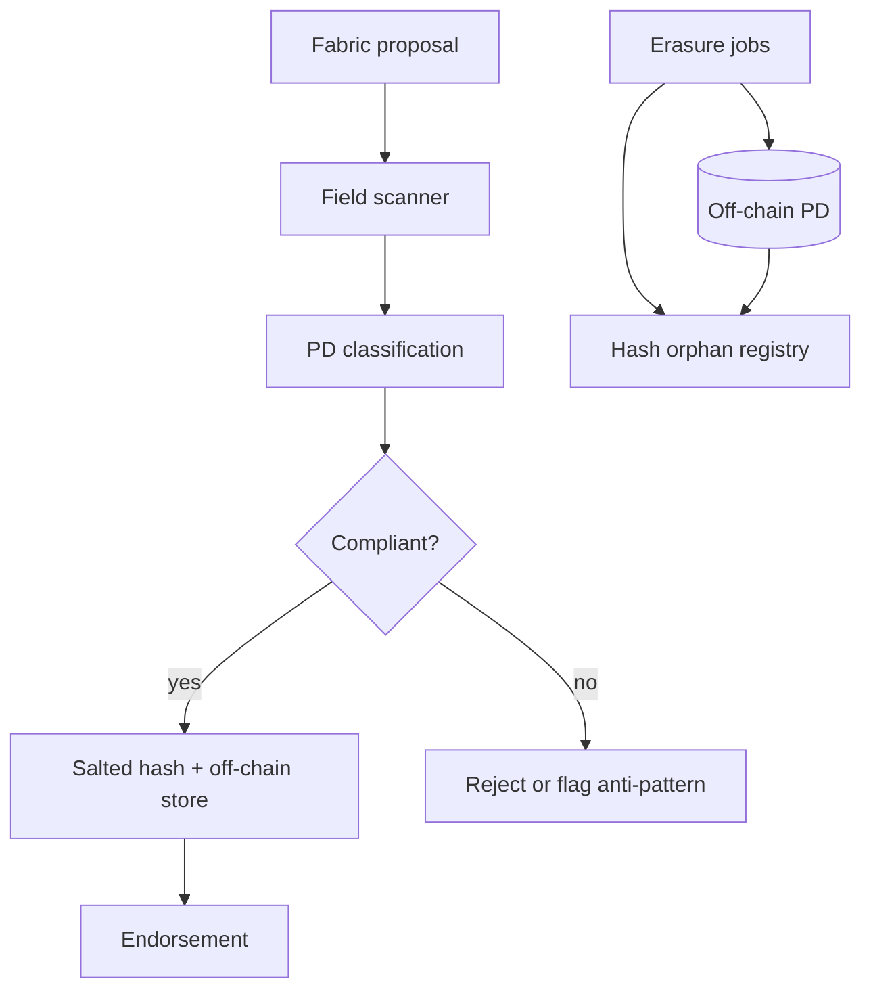

# Offhash

**Source:** `ai-in-decentralized+ai/architecturesexplored-gdprv1-181010140325/`
**Domain:** `ai-decentralized`
**One-liner:** A Hyperledger Fabric personal-data architecture guard that blocks personal-data-bearing fields from landing on-chain, enforces off-chain PD stores with salted hash proofs, flags non-compliant private-collection and encrypt-on-chain patterns, and completes erasure by off-chain delete plus hash orphaning.
**Wedge:** Fabric solution architects who believed Private Data Collections or encrypt-on-chain were GDPR-safe — the IBM Architectures Explored deck proves only off-chain PD with salted hashes on-chain works today, with explicit FAB-1151 private-writeset undeletability and encrypt-as-pseudonym risks.
**Positioning:** Fabric-specific PD enforcement. The deck contrasts mutable world state with immutable blockchain, maps every Fabric block field that can carry PD (proposal payload, client cert, keys/values, events, chaincode response), and rejects private-data-collection and encrypt-on-chain shortcuts. Offhash is runtime policy for that architecture — distinct from Aliaskeep (general pseudonym link governance across consortia).

## Market research synthesis

### Thesis from source

IBM's "Architectures Explored — GDPR" (Blockchain Platform Explored series, v1.1, October 2018) summarises GDPR effective 25 May 2018: applies to EU organisations and non-EU organisations offering goods/services to EU individuals; fines up to €20M or 4% global revenue; defines controllers, processors, and data-subject rights including access, rectification, erasure, restriction, portability, and objection to marketing/automated processing. Personal data includes names, email, IDs, location, IP, cookies, advertising IDs.

On "right to erasure" versus blockchain: transactions in the blockchain are immutable while world-state data can be mutable — but anything written into block fields persists. The deck diagrams Hyperledger Fabric block anatomy highlighting PD risk in: proposal payload (transaction arguments), client certificate (if individual to a data subject), world-state keys and values, chaincode events, and chaincode response payloads. Endorser/orderer org certificates are assumed non-PD, but configuration blocks also contain certificates.

The compliant solution is explicit: store personal data only in off-chain mutable storage; place on-chain solely proofs — salted hashes linking to PD (warning: hashes and salted hashes remain pseudonymous PD under GDPR); deleting off-chain PD orphanizes the hash into anonymised state. Non-compliant patterns are catalogued:

1. **Private Data Collections (Fabric 1.2):** PD sent in transient field, stored in private state with hashes on channel — but FAB-1151 private writeset storage behaves like blockchain storage and cannot be deleted except via blockToLive collection policy, so erasure requests fail. Future FAB-5097 may enable on-demand deletion but had no timeframe in the deck.

2. **Encrypt on-chain:** PD encrypted before ledger write with keys in mutable store — "unproven for compliance"; encrypted data is pseudonymous; key management adds re-identification risk if keys leak.

Offhash productises enforcement of the compliant pattern and automatic rejection/flagging of the documented anti-patterns at Fabric transaction submission time.

### Buyer & economic model

- **Primary buyer:** Hyperledger Fabric platform owner or lead chaincode architect accountable to the DPO for ledger hygiene.
- **Users:** chaincode developers, DevOps running Fabric peers/orderers, privacy engineers configuring off-chain PD stores, auditors verifying hash orphanization after erasure, integration teams piping API payloads into proposals.
- **Budget owner / value metric:** blockchain platform budget; value metric is zero PD-bearing blocks post-deployment, successful erasure drills (off-chain delete + hash orphan proof), and avoided rework from non-compliant PDC/encrypt designs.
- **Competing status quo:** manual chaincode review, post-hoc block scanning, assuming private collections are "private enough," or encryption without erasure story.

### Domain constraints

- **Regulatory / trust / safety:** salted hashes remain pseudonymous PD until source deleted; client certs in blocks may be PD; config block certificates; cross-org endorsement visibility; FAB-1151 deletion limits until FAB-5097 ships.
- **Data sensitivity:** off-chain PD store is tier-one; on-chain hashes and metadata lower but still regulated; encryption keys must not sit on immutable ledger.
- **Change-management realities:** live Fabric networks may already contain PD — Offhash must block new violations first, then support remediation workflows with Aliaskeep/Forgetcase.

## Business requirements

- BR-1: Transaction proposals must be scanned pre-endorsement for PD in payload arguments, key names, key values, events, and responses — matching deck field list.
- BR-2: Only salted hash references approved by policy may be written to world state or transaction records; raw PD must route to off-chain mutable stores.
- BR-3: Client certificates tied to individual data subjects must be blocked or replaced with org-level or ZK-derived credentials before commit.
- BR-4: Private Data Collection patterns that persist undeletable private writesets (FAB-1151) must be flagged non-compliant unless explicit blockToLive erasure proof exists.
- BR-5: Encrypt-on-chain patterns must be flagged as unproven compliance with documented risk acceptance workflow — not silently allowed.
- BR-6: Erasure must delete off-chain PD then record hash orphanization evidence showing the on-chain reference no longer links to living PD.
- BR-7: Policy engine must integrate with Fabric endorsement pipeline to reject violating transactions before they reach orderers.
- BR-8: Architects must receive actionable remediation hints (move field X off-chain, salt hash Y) rather than generic errors.
- BR-9: Configuration block certificate reviews must be scheduled because config blocks also carry certificates per deck warning.
- BR-10: Range queries and read sets that embed PD in keys must be detected equally with write sets.
- BR-11: Audit exports must map each on-chain hash to off-chain store location and erasure status for DPIA evidence.
- BR-12: Future FAB-5097 features may toggle PDC compliance mode — platform must version policies against Fabric release.

## User stories

Canonical user stories live in sibling [USER_STORIES.md](USER_STORIES.md).

## System design

### Overview

Offhash embeds in the Fabric submission path: proposal simulator extracts fields matching the deck's PD surface area; classifier detects PD; compliant path replaces values with salted hashes and writes PD to configured off-chain stores; non-compliant PDC/encrypt patterns raise policy violations; erasure service deletes off-chain records and marks hashes orphaned with audit proofs. Config-block certificate monitoring runs on schedule outside the hot path.

### Actors & boundaries

- **Actors:** chaincode developer, platform architect, privacy engineer, peer DevOps, auditor, DPO, Offhash operator; Fabric peers/orderers as infrastructure.
- **Trust boundary:** PD never persists in block fields after guard processing; off-chain stores sit in controller-controlled infrastructure; Offhash holds policies, scan logs, hash registry.
- **Human-in-the-loop points:** encrypt/PDC risk acceptance; erasure approval; remediation of legacy PD blocks; Fabric version policy updates.

### Core capabilities

1. **Fabric field scanner** — payload, cert, key/value, events, responses.
2. **PD classification** — pattern and content detectors including binaries.
3. **Salted hash enforcement** — approved on-chain reference format.
4. **Off-chain PD router** — mutable store writes with hash linkage.
5. **Anti-pattern detection** — PDC/FAB-1151, encrypt-on-chain flags.
6. **Erasure and orphanization** — off-chain delete + proof registry.
7. **Endorsement integration** — pre-commit allow/deny across orgs.
8. **Compliance reporting** — violation attempts, erasure drills, hash map exports.

### Conceptual data

- **Primary entities:** FabricPolicy, TransactionProposal, PdScanResult, SaltedHashRecord, OffChainPdRecord, OrphanizationProof, AntiPatternFlag, EndorsementDecision, ErasureJob, ConfigCertReview.
- **Critical events:** proposal scanned, PD blocked, hash written, off-chain stored, PDC flagged, erasure completed, hash orphaned.
- **Retention / audit needs:** scan and orphan proofs for accountability; off-chain PD retention follows controller policy; on-chain hashes immutable by design.

### Integrations (conceptual)

- **Systems of record:** Hyperledger Fabric peer endorsement plugins, off-chain PD databases, Aliaskeep link vault (optional), Forgetcase erasure cases.
- **Upstream signals:** chaincode proposals, transient/private collection attempts, client cert enrollment feeds.
- **Downstream actions:** endorse/deny, off-chain CRUD, erasure webhooks, architect dashboards, audit PDF/JSON exports.

### High-level architecture

### Success metrics

- **Leading:** proposals blocked for PD; PDC/encrypt patterns flagged; erasure drill success rate; median scan latency on endorsement path.
- **Lagging:** PD incidents in committed blocks (target zero post-rollout); Article 17 drill pass rate; architect rework hours avoided; Fabric audit findings closed.

## OpenAPI skeleton

Canonical HTTP surface lives in sibling [openapi.yaml](openapi.yaml). Summary:

- **Base path:** `/v1/...`
- **Auth:** `X-API-Key` for peer endorsement plugin; Bearer JWT for architects and auditors.
- **Resource groups:** Policies, Scans, HashRecords, Erasures, AntiPatterns, Reporting.
