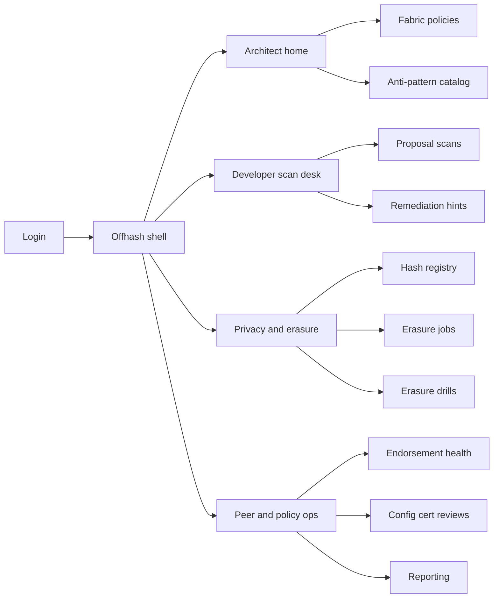
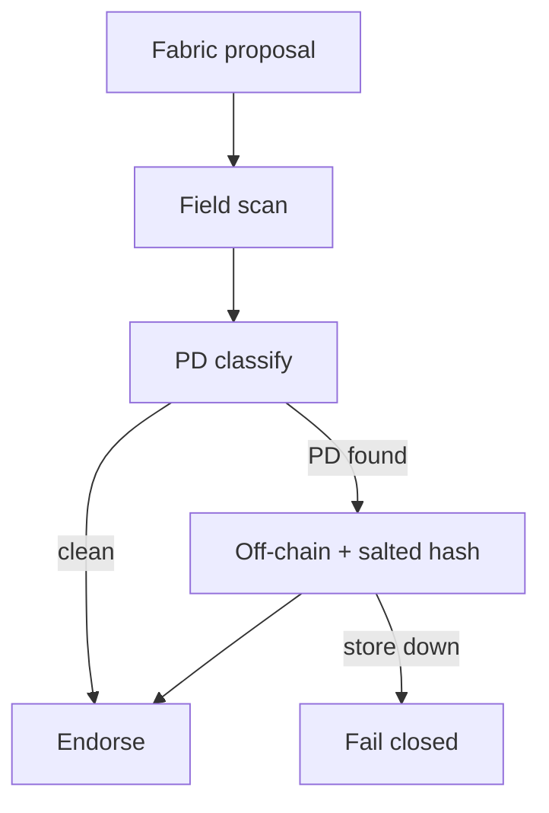
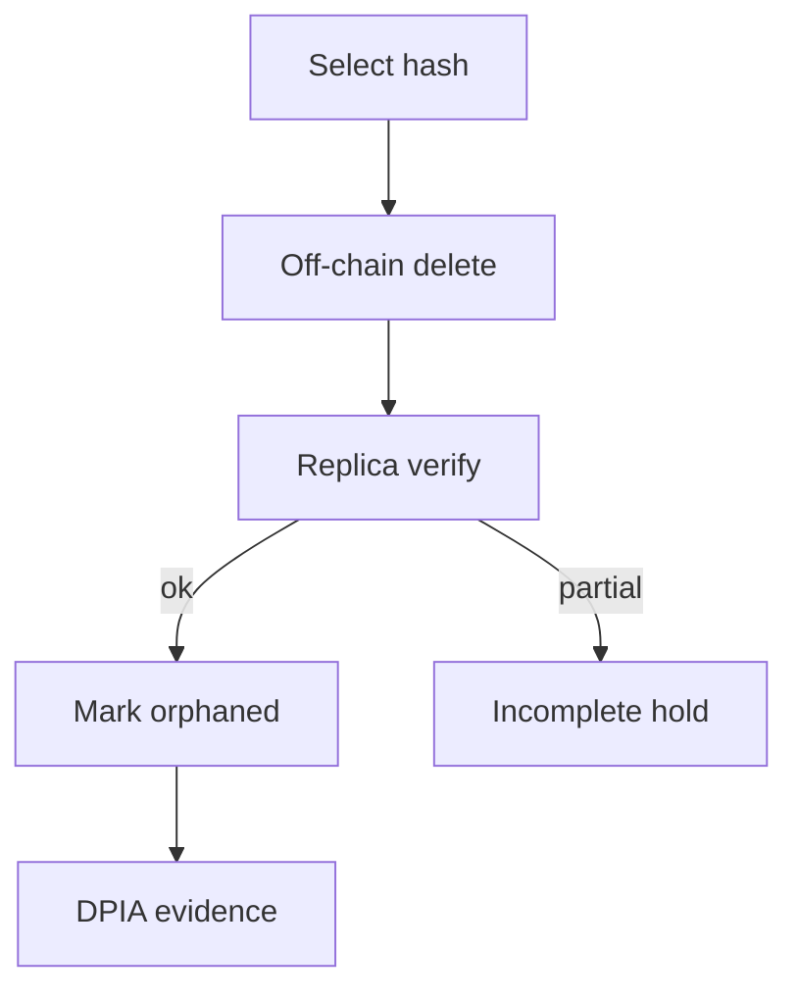

# Offhash — Web app

**Product:** [PRODUCT.md](./PRODUCT.md)
**Primary surface:** Fabric PD architecture console (architect + privacy engineer under one Offhash shell)
**Secondary surfaces:** Peer endorsement plugin status (read-only health); DPIA / erasure-drill export viewer
**Design thesis:** Offhash is a ledger hygiene gate for Hyperledger Fabric — not a generic privacy questionnaire tool. The UI metaphor is a block anatomy X-ray: proposal payload, client cert, keys/values, events, and responses are lit as PD risk surfaces; only salted-hash + off-chain routes glow as compliant. Visual language is cool steel on deep ink with orphan-amber for hashes still linked to living PD and seal-green when orphanization completes. The brand wordmark sits as a quiet assay mark on every policy and erasure screen so DPO and auditors know whose Fabric guard they are trusting.

## UX research synthesis

### Category peers (best-in-class)

- **Hyperledger Fabric Explorer / Operations Console:** Channel/block/tx drill-down, peer health. Steal: block-field navigation that mirrors Fabric anatomy; reject Explorer’s post-hoc inspection-only model — Offhash must block pre-endorsement.
- **OneTrust / TrustArc DPIA modules:** Evidence packs, control effectiveness, Article 17 workflows. Steal: erasure drill as a first-class evidence object; reject questionnaire-heavy UX as the daily developer loop.
- **BigID / Collibra data discovery:** Field-level PD classification, scan results with remediation. Steal: actionable “move field X off-chain” hints tied to scan hits; reject enterprise catalog sprawl that hides Fabric-specific FAB-1151 citations.
- **IBM Blockchain Platform / Fabric CA tooling:** Network topology, cert enrollment. Steal: config-block certificate review scheduling; reject treating encryption-on-chain as a compliance checkbox.

### Patterns to adopt / reject

- **Adopt:** Pre-endorsement scan results as the developer home; Fabric field map (payload/cert/key/event/response) as primary chrome; FAB-1151 / encrypt-on-chain anti-pattern cards with citations; hash registry with linked→orphaned states; fail-closed store-unavailable banner; remediation templates for salted hash + off-chain PD.
- **Reject:** Purple “AI privacy score”; silent allow of PDC as “private enough”; editable orphan proofs; generic GDPR checklists without Fabric block anatomy; rainbow KPI tiles.

### Trust, density, and workflow constraints from PRODUCT.md

Architects need dense, field-level feedback on proposals (BR-1, BR-8) without exposing raw PD in audit UIs beyond role need. Only salted hashes may land on-chain (BR-2); client-subject certs must be blocked or replaced (BR-3). PDC and encrypt-on-chain are flagged, not quietly allowed (BR-4, BR-5). Erasure is off-chain delete + orphan proof (BR-6). Endorsement hooks must be consistent across orgs (BR-7). Config-block cert reviews are scheduled outside the hot path (BR-9). Read sets and range queries get equal detection (BR-10). Audit exports map hash → store → erasure status (BR-11).

## Information architecture

### Nav model

### Roles → default home

| Role | Default home | Why |
|------|--------------|-----|
| Fabric platform architect | Architect home — blocked vs flagged | Network hygiene (BR-4, BR-5, BR-7) |
| Chaincode developer | Proposal scan desk | Pre-commit fix loop (BR-1, BR-8) |
| Privacy engineer | Hash registry + erasure jobs | Article 17 orphanization (BR-6) |
| DevOps / peer operator | Endorsement health | No rogue-peer bypass (BR-7) |
| Auditor / DPO | Reporting + erasure drills | DPIA evidence (BR-11) |

### Cross-links to OpenAPI resources

| Nav area | OpenAPI tags / resources |
|----------|---------------------------|
| Fabric policies | Policies |
| Proposal scans | Scans |
| Salted hash registry | HashRecords |
| Erasure / orphanization | Erasures |
| PDC / encrypt / cert flags | AntiPatterns |
| Violation and drill exports | Reporting |

## Screen inventory

### Architect home

- **Purpose:** Answer “are we still writing PD into Fabric blocks?” in one composition.
- **Entry:** Post-login for architect roles.
- **Layout regions:** Brand + network selector; PD blocked / anti-pattern flagged / erasure-drill pass strip; recent violations by Fabric field; peer endorsement coverage map.
- **Primary actions:** Open policy; open anti-pattern case; export DPIA slice.
- **Empty / loading / error:** Empty = first policy wizard for Fabric version; error = plugin unreachable (fail-closed status).
- **BR / story ties:** BR-1, BR-7, BR-12; architect stories.

### Fabric policy editor

- **Purpose:** Version PD enforcement against Fabric release; toggle future FAB-5097 PDC modes deliberately.
- **Entry:** Architect nav → Policies.
- **Layout regions:** Policy list by network/channel; field coverage checklist (payload, cert, key/value, events, responses, read sets); Fabric version; fail-closed store setting; FAB-5097 mode toggle with warning.
- **Primary actions:** Publish policy; simulate against sample proposal; rollback version.
- **Empty / loading / error:** Unpublished draft cannot attach to endorsement plugin.
- **BR / story ties:** BR-7, BR-10, BR-12.

### Proposal scan desk

- **Purpose:** Pre-endorsement feedback when chaincode puts PD in state keys or payloads.
- **Entry:** Developer default; CI deep link.
- **Layout regions:** Scan input / recent scans; Fabric field heat map; PD hits with remediation hints (“move email off-chain, salt hash Y”); allow/deny decision.
- **Primary actions:** Re-scan; copy remediation snippet; open anti-pattern detail.
- **Empty / loading / error:** Empty = paste sample proposal; 422 block state explained with field path.
- **BR / story ties:** BR-1, BR-8; developer stories.

### Anti-pattern catalog

- **Purpose:** Auto-flag PDC (FAB-1151) and encrypt-on-chain with documented risk acceptance — never silent allow.
- **Entry:** Architect home; scan desk escalation.
- **Layout regions:** Flag queue; FAB-1151 / encrypt cards with deck citations; blockToLive proof upload for PDC exception; risk-acceptance workflow pane.
- **Primary actions:** Accept risk with expiry; reject design; notify developers.
- **Empty / loading / error:** Empty = healthy “no anti-patterns”; expired acceptance reopens flag.
- **BR / story ties:** BR-4, BR-5.

### Hash registry

- **Purpose:** Show salted on-chain references linked to off-chain PD, with pseudonym warning chrome.
- **Entry:** Privacy nav.
- **Layout regions:** Hash table (linked / orphaned); off-chain store locator; legal banner that salted hashes remain pseudonymous PD until orphaned.
- **Primary actions:** Open linked record; start erasure; export hash map.
- **Empty / loading / error:** Empty = no hashes yet; store unavailable = coral fail-closed banner.
- **BR / story ties:** BR-2, BR-6, BR-11; privacy engineer stories.

### Erasure jobs and orphanization

- **Purpose:** Delete off-chain PD then record orphanization evidence so Article 17 is demonstrable.
- **Entry:** Hash row → Erase; privacy home.
- **Layout regions:** Job queue; delete webhook status across replicas; orphan proof preview; dual-control approve.
- **Primary actions:** Run erasure; verify orphan; attach to drill.
- **Empty / loading / error:** Partial replica delete = blocked incomplete state.
- **BR / story ties:** BR-6.

### Erasure drills

- **Purpose:** Scheduled proof that hash orphanization works end-to-end for DPIA.
- **Entry:** Privacy / auditor nav.
- **Layout regions:** Drill calendar; pass/fail history; sample subject selection; evidence package.
- **Primary actions:** Run drill; export proof pack.
- **Empty / loading / error:** Failed drill = coral with runbook link.
- **BR / story ties:** BR-6, BR-11; architect Article 17 story.

### Endorsement health

- **Purpose:** Confirm Offhash hooks on all org peers so policy cannot be bypassed.
- **Entry:** DevOps default.
- **Layout regions:** Peer matrix (org × peer × plugin version); last heartbeat; fail-closed incidents.
- **Primary actions:** Redeploy hook; quarantine peer.
- **Empty / loading / error:** Missing peer = blocking banner.
- **BR / story ties:** BR-7; DevOps stories.

### Config certificate reviews

- **Purpose:** Scheduled review because config blocks also carry certificates that may be PD.
- **Entry:** Ops nav → Config certs.
- **Layout regions:** Review schedule; cert inventory; subject-vs-org classification; remediation tasks.
- **Primary actions:** Mark reviewed; open remediations; export findings.
- **Empty / loading / error:** Overdue review = amber banner.
- **BR / story ties:** BR-3, BR-9.

### Reporting and DPIA export

- **Purpose:** Block-level report of PD violations attempted vs blocked; hash→store→erasure map.
- **Entry:** Auditor / DPO home.
- **Layout regions:** Period filters; violation attempts vs blocks; erasure drill results; export controls.
- **Primary actions:** Generate DPIA export; download JSON/PDF.
- **Empty / loading / error:** No scans in period.
- **BR / story ties:** BR-11; auditor stories.

## Key flows

1. **Compliant write path** — proposal scanned → PD classified → salted hash + off-chain store → endorse; failure: store down fail-closed.

2. **Anti-pattern flag** — PDC or encrypt-on-chain detected → FAB-1151/encrypt citation → reject or time-boxed risk acceptance (BR-4, BR-5).

3. **Erasure** — select hash → delete off-chain replicas → orphan proof → audit export (BR-6).

4. **Developer remediation** — scan hit on email-in-key → hint template → resubmit clean proposal (BR-8).

5. **Config cert review** — schedule fires → classify certs → remediate subject-bound certs (BR-9).

## Design system

### Tokens (CSS variables)

- `--color-ink: #E8EEF4` — primary text
- `--color-ink-950: #0B1118` — app ground
- `--color-steel-900: #141C28` — panels
- `--color-steel-700: #2C3A4C` — dividers
- `--color-assay: #4DB6A0` — compliant hash / orphan complete
- `--color-assay-dim: #1F6B5C` — assay on dark
- `--color-amber: #D9A441` — linked hash / overdue review
- `--color-coral: #E0574F` — PD block / fail-closed
- `--color-steel: #7A90A6` — secondary labels
- `--color-brand: #A8D5C8` — Offhash wordmark
- `--font-display: "Source Sans 3", sans-serif`
- `--font-mono: "Source Code Pro", monospace` — hashes, tx ids, field paths
- `--space-1`…`--space-8`: 4px scale
- `--radius-sm: 4px`; `--radius-md: 6px` — instrument panel, not soft SaaS
- `--motion-scan: 160ms ease-out` — field hit highlight
- `--motion-orphan: 220ms ease-out` — linked→orphaned transition
- `--motion-failclosed: 200ms ease-in` — coral banner entrance
- Atmosphere: faint Fabric block schematic watermark in steel-900; cool steel gradient vignette — not purple, not cream-serif.

### Typography & brand

- Display for screen titles and KPI counts; mono for salted hashes, field paths (`proposal.payload.args[2]`), FAB ticket citations.
- Brand wordmark in shell chrome on policy, scan, and erasure views.
- Login shell: brand hero; headline (“Keep personal data off the ledger”); one CTA.

### Do / don’t

- **Do:** Show Fabric field anatomy on every scan; cite FAB-1151 on PDC flags; warn salted hashes are pseudonymous until orphaned; fail-closed when off-chain store is down.
- **Don’t:** Treat PDC as compliant by default; purple privacy glow; hide remediation behind generic errors; card grids of static GDPR articles.

### Accessibility & domain trust cues

- AA+ contrast; block/allow never colour-only — icons + text.
- Live regions for fail-closed and erasure completion.
- Focus order: policy → scan → hash → erasure → export.

## Component patterns

- **FabricFieldHeatmap** — payload / cert / key / event / response risk map.
- **RemediationHintRow** — actionable move-off-chain / salt-hash snippet.
- **AntiPatternCitationCard** — FAB-1151 or encrypt-on-chain with deck reference.
- **HashLifecycleChip** — linked | orphaned with pseudonym warning.
- **FailClosedBanner** — store unavailable blocks endorse path.
- **OrphanizationProofPanel** — delete + orphan evidence for drills.
- **PeerHookMatrix** — org × peer plugin coverage.
- **DpiaExportPack** — violations + hash map + drill results.

## Out of scope for v1 web

- General multi-chain privacy (non-Fabric); Aliaskeep link-vault product UI; Forgetcase case-management full suite; native mobile; rewriting historical blocks that already contain PD (remediation handoff only); full chaincode IDE.
